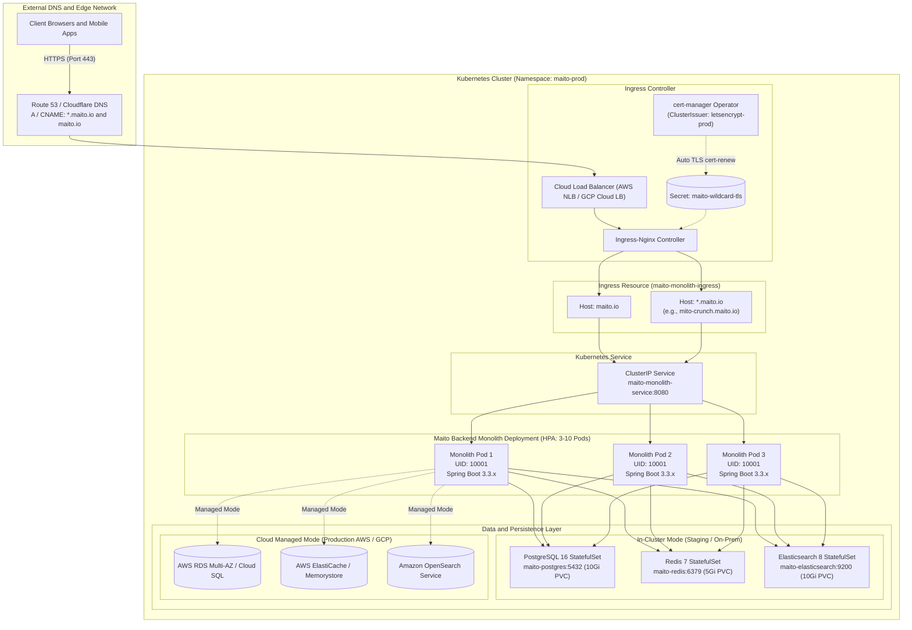

# PHASE 16: KUBERNETES & HELM PRODUCTION DEPLOYMENT RUNBOOK

## EXECUTIVE SUMMARY & ARCHITECTURE OVERVIEW

Phase 16 delivers an enterprise-grade, cloud-native Kubernetes deployment architecture for the **Maito Multi-Tenant Monolith Platform** (Spring Boot 3.3.x on Java 21, PostgreSQL 16 database-per-tenant, Redis 7, and Elasticsearch 8.13.4).

The deployment suite provides:
1. **Production Helm 3 Chart (`deploy/helm/maito-monolith/`)**: Modular, parameterized, and environment-tailored for local, staging, and multi-cloud production.
2. **Raw Declarative K8s Manifests (`deploy/k8s/`)**: Cloud-native GitOps-ready manifests compatible with ArgoCD, Flux, and Kustomize.
3. **Wildcard Multi-Tenant Subdomain Routing (`*.maito.io`)**: Powered by Ingress-Nginx and automated TLS issuance via cert-manager (Let's Encrypt DNS-01).
4. **Pod Security Standards (PSS) Restricted Profile**: Non-root UID/GID 10001, dropped capabilities (`ALL`), privilege escalation disabled, runtime default seccomp profile.
5. **High Availability (HA) & Self-Healing**: Zero-downtime rolling updates (`maxSurge: 25%`, `maxUnavailable: 0`), HPA v2 (CPU 70%, Memory 80%), and PDB (`minAvailable: 1`).
6. **Flexible Persistence Modes**: In-cluster StatefulSets with PV/PVC for staging/on-prem and seamless toggle to managed cloud services (AWS RDS, ElastiCache, OpenSearch / GCP Cloud SQL, Memorystore).

---

## 1. END-TO-END INGRESS & MULTI-TENANT ARCHITECTURE DIAGRAM



---

## 2. INSTALLATION GUIDE: LOCAL TESTING (MINIKUBE & KIND)

### A. Local Setup with Kind (Kubernetes in Docker)
Create a Kind cluster with ports 80 and 443 forwarded to the local host machine:

```bash
cat <<EOF > kind-cluster-config.yaml
kind: Cluster
apiVersion: kind.x-k8s.io/v1alpha4
nodes:
- role: control-plane
  kubeadmConfigPatches:
  - |
    kind: InitConfiguration
    nodeRegistration:
      kubeletExtraArgs:
        node-labels: "ingress-ready=true"
  extraPortMappings:
  - containerPort: 80
    hostPort: 80
    protocol: TCP
  - containerPort: 443
    hostPort: 443
    protocol: TCP
EOF

kind create cluster --name maito-local --config kind-cluster-config.yaml
```

### B. Install Ingress-Nginx for Local Kind
```bash
kubectl apply -f https://raw.githubusercontent.com/kubernetes/ingress-nginx/main/deploy/static/provider/kind/deploy.yaml

# Wait for Ingress controller to be ready
kubectl wait --namespace ingress-nginx \
  --for=condition=ready pod \
  --selector=app.kubernetes.io/component=controller \
  --timeout=180s
```

### C. Deploy Using Helm 3
```bash
# Create namespace
kubectl create namespace maito-prod

# Validate and dry-run Helm release
helm lint deploy/helm/maito-monolith
helm template maito-monolith deploy/helm/maito-monolith -f deploy/helm/maito-monolith/values.yaml

# Install the chart using local default values
helm install maito-monolith deploy/helm/maito-monolith \
  -f deploy/helm/maito-monolith/values.yaml \
  --namespace maito-prod
```

### D. Deploy Using Raw Declarative Manifests
```bash
# Deploy all resources in declarative order
kubectl apply -f deploy/k8s/
```

### E. Simulate Multi-Tenant Subdomain Access Locally
Add the local test domains to `/etc/hosts` (or `C:\Windows\System32\drivers\etc\hosts` on Windows):
```text
127.0.0.1 maito.io
127.0.0.1 mito-crunch.maito.io
127.0.0.1 tenant-demo.maito.io
```

Test local endpoint resolution:
```bash
curl -H "Host: mito-crunch.maito.io" http://localhost/actuator/health/readiness
```

---

## 3. PRODUCTION DEPLOYMENT GUIDE: AWS EKS & GCP GKE

### A. AWS Elastic Kubernetes Service (EKS)
In enterprise production on AWS EKS, ingress traffic is handled by the AWS Load Balancer Controller provisioning a Network Load Balancer (NLB) in front of the Ingress-Nginx controller, while storage and stateful components leverage AWS managed databases (Amazon RDS Aurora PostgreSQL, Amazon ElastiCache Redis, and Amazon OpenSearch Service).

1. **Enable AWS Managed Services in Helm**:
   Update or pass `values-production.yaml`:
   ```yaml
   cloud:
     provider: "aws"
     managedServices:
       enabled: true

   postgres:
     enabled: false # Use external RDS
     external:
       host: "maito-prod-aurora.cluster-ro-xyz.us-east-1.rds.amazonaws.com"
       port: 5432
       username: "maito_admin"
       secretKeyRef:
         name: "maito-production-secrets"
         key: "database-password"

   redis:
     enabled: false # Use external ElastiCache
     external:
       host: "maito-prod-redis.xyz.cache.amazonaws.com"
       port: 6379

   elasticsearch:
     enabled: false # Use external OpenSearch
     external:
       host: "https://search-maito-prod-es-xyz.us-east-1.es.amazonaws.com"
       port: 443
   ```

2. **Deploy Helm Release on AWS EKS**:
   ```bash
   helm upgrade --install maito-monolith deploy/helm/maito-monolith \
     -f deploy/helm/maito-monolith/values-production.yaml \
     --namespace maito-prod \
     --create-namespace \
     --set app.image.tag=v15.0.0-phase15-search
   ```

### B. Google Kubernetes Engine (GKE)
1. **Workload Identity Setup**:
   Ensure Google Cloud Service Account (GSA) is bound to the Kubernetes Service Account (KSA) for cert-manager DNS-01 challenges and Cloud SQL / Memorystore connectivity.
2. **Deploy Helm Release on GKE**:
   ```bash
   helm upgrade --install maito-monolith deploy/helm/maito-monolith \
     -f deploy/helm/maito-monolith/values-production.yaml \
     --namespace maito-prod \
     --set cloud.provider="gcp" \
     --set app.image.tag=v15.0.0-phase15-search
   ```

---

## 4. CERT-MANAGER & WILDCARD TLS VIA DNS-01 CHALLENGE

### Why DNS-01 is Mandatory for Wildcard Subdomains
Let's Encrypt requires the **DNS-01 ACME challenge** for wildcard certificates (`*.maito.io`). HTTP-01 challenges cannot validate wildcard certificates because the ACME server must verify domain ownership across all possible subdomains via a DNS TXT record (`_acme-challenge.maito.io`).

### Route 53 (AWS) DNS-01 Issuer Configuration
```yaml
apiVersion: cert-manager.io/v1
kind: ClusterIssuer
metadata:
  name: letsencrypt-prod
spec:
  acme:
    server: https://acme-v02.api.letsencrypt.org/directory
    email: devops@maito.io
    privateKeySecretRef:
      name: letsencrypt-prod-account-key
    solvers:
    - dns01:
        route53:
          region: us-east-1
          hostedZoneID: Z123456789ABCDEF
          role: arn:aws:iam::123456789012:role/cert-manager-route53-role
```

### Certificate Lifecycle Verification
```bash
# Verify ClusterIssuer status
kubectl get clusterissuer letsencrypt-prod

# Inspect certificate generation progress
kubectl get certificate maito-wildcard-tls -n maito-prod
kubectl describe certificate maito-wildcard-tls -n maito-prod

# Verify certificate requests and DNS-01 challenges
kubectl get certificaterequest -n maito-prod
kubectl get challenges -n maito-prod
```

---

## 5. ROLLING ZERO-DOWNTIME DEPLOYMENTS, ROLLBACKS & HPA TUNING

### Zero-Downtime Deployment Strategy
The Monolith `Deployment` uses Kubernetes `RollingUpdate` with:
- `maxSurge: 25%`: Spawns 25% new pods before terminating existing pods.
- `maxUnavailable: 0`: Guarantees zero downtime by never allowing running pod count to drop below the desired minimum during rollouts.
- **Liveness Probe**: `GET /actuator/health/liveness` (initialDelaySeconds: 30, periodSeconds: 10, failureThreshold: 3).
- **Readiness Probe**: `GET /actuator/health/readiness` (initialDelaySeconds: 15, periodSeconds: 5, failureThreshold: 3).

### Executing a Zero-Downtime Upgrade
```bash
helm upgrade maito-monolith deploy/helm/maito-monolith \
  -f deploy/helm/maito-monolith/values-production.yaml \
  --namespace maito-prod \
  --set app.image.tag=v16.0.0 \
  --wait --timeout 5m
```

Monitor rollout progress in real time:
```bash
kubectl rollout status deployment/maito-monolith-deployment -n maito-prod
```

### Instant Rollback
If application regressions or latency spikes are detected, trigger an instant rollback:
```bash
# View release history
helm history maito-monolith -n maito-prod

# Rollback to the previous stable revision (e.g. revision 1)
helm rollback maito-monolith 1 -n maito-prod

# Verify rollback deployment status
kubectl rollout status deployment/maito-monolith-deployment -n maito-prod
```

### Horizontal Pod Autoscaler (HPA v2) Tuning
The Monolith HPA dynamically scales pod replicas between 3 and 10 based on CPU and Memory:
```yaml
metrics:
- type: Resource
  resource:
    name: cpu
    target:
      type: Utilization
      averageUtilization: 70
- type: Resource
  resource:
    name: memory
    target:
      type: Utilization
      averageUtilization: 80
behavior:
  scaleUp:
    stabilizationWindowSeconds: 0
    policies:
    - type: Percent
      value: 50
      periodSeconds: 15
  scaleDown:
    stabilizationWindowSeconds: 300
    policies:
    - type: Percent
      value: 10
      periodSeconds: 60
```

Check real-time HPA metrics:
```bash
kubectl get hpa maito-monolith-hpa -n maito-prod --watch
```

### Pod Disruption Budget (PDB)
To guard against cluster node draining, automated node upgrades, or spot-instance evictions:
```yaml
apiVersion: policy/v1
kind: PodDisruptionBudget
metadata:
  name: maito-monolith-pdb
  namespace: maito-prod
spec:
  minAvailable: 1
  selector:
    matchLabels:
      app.kubernetes.io/name: maito-monolith
```

---

## 6. VALIDATION SCRIPTS & SRE DIAGNOSTICS

Run the automated cross-platform validation script:
```powershell
# PowerShell (Windows)
powershell -ExecutionPolicy Bypass -File deploy/scripts/validate-k8s.ps1
```

```bash
# Bash (Linux / macOS / CI/CD Runners)
chmod +x deploy/scripts/validate-k8s.sh
./deploy/scripts/validate-k8s.sh
```

Check running pods, services, and ingress endpoints:
```bash
kubectl get all,ingress,pvc,hpa,pdb -n maito-prod
```
