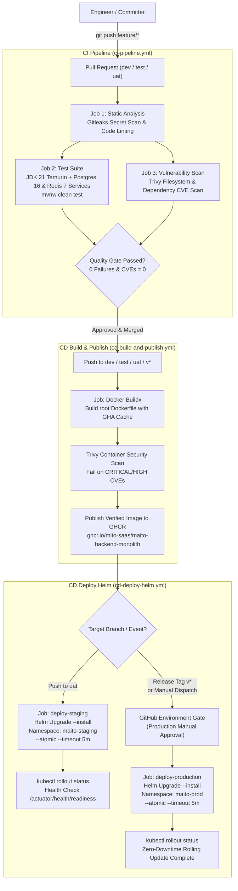

# PHASE 17: CI/CD PIPELINE AUTOMATION RUNBOOK

## EXECUTIVE SUMMARY & ARCHITECTURE OVERVIEW

Phase 17 establishes an enterprise-grade, zero-trust automated Continuous Integration and Continuous Deployment (CI/CD) ecosystem for the **Maito Multi-Tenant Monolith Platform** using **GitHub Actions**, **Docker Buildx with Layer Caching**, **Trivy Container Security Scanning**, **Gitleaks**, and **Helm 3 Release Management**.

Key Architectural Capabilities:
1. **Automated Quality Gates**: Enforces static code analysis, Gitleaks secret scanning, Temurin JDK 21 compilation, and full integration tests against real PostgreSQL 16 and Redis 7 service containers on every Pull Request and branch push.
2. **Container Security & Supply Chain Integrity**: Scans both repository filesystem and container images with **Trivy**, failing builds on unresolved `CRITICAL` or `HIGH` CVEs.
3. **Build Layer Caching**: Employs GitHub Actions Cache backend (`type=gha`) with Docker Buildx to accelerate image builds.
4. **Multi-Tier GitOps Continuous Deployment**:
   - Staging (UAT) deployment triggers automatically upon merge to branch `uat` into namespace `maito-staging`.
   - Production deployment triggers upon release tags (`v*`) with GitHub Environment approval gates into namespace `maito-prod`.
   - Atomic Helm rollouts (`--atomic --timeout 5m`) guarantee automated rollback upon pod initialization or readiness failures.

---

## 1. END-TO-END CI/CD PIPELINE WORKFLOW DIAGRAM



---

## 2. GITHUB REPOSITORY SECRETS & ENVIRONMENT CONFIGURATION

To operate this pipeline in GitHub, configure the following secrets under **Settings > Secrets and variables > Actions**:

| Secret Name | Required By | Description | Example / Format |
|---|---|---|---|
| `GITHUB_TOKEN` | Built-in | Used by Gitleaks and for logging in to GitHub Container Registry (`ghcr.io`). | Automatically provided by GitHub Actions |
| `GHCR_TOKEN` | Optional Override | Personal Access Token (classic with `write:packages`) if fine-grained registry tokens are desired. | `ghp_xxxxxxxxxxxx` |
| `KUBECONFIG_STAGING` | `cd-deploy-helm.yml` | Base64-encoded or plain Kubeconfig granting access to the staging/UAT Kubernetes cluster. | `apiVersion: v1... (base64)` |
| `KUBECONFIG_PROD` | `cd-deploy-helm.yml` | Base64-encoded or plain Kubeconfig granting access to the production EKS/GKE cluster. | `apiVersion: v1... (base64)` |

### GitHub Environments Setup:
1. **`staging` Environment**:
   - URL: `https://staging.maito.io`
   - Deployment protection rules: None (auto-deploys upon merge to `uat`).
2. **`production` Environment**:
   - URL: `https://maito.io`
   - Deployment protection rules: Enable **Required reviewers** (DevOps Lead / SRE Manager sign-off before rollout).

---

## 3. BRANCH-TO-ENVIRONMENT PROMOTION PATH

The Maito platform follows a multi-tier enterprise branch promotion model:

```text
feature/* ──(PR & CI)──> dev ──(Merge & Sync)──> test ──(Merge & Sync)──> uat ──(Tag Release)──> vX.Y.Z (Production)
   │                       │                       │                       │                             │
Local Dev             Unit/E2E CI              QA Staging               Pre-Prod UAT                  Zero-Downtime Prod
                      Image build              Docker push              Helm deploy                   Protected Helm deploy
```

1. **`dev` (Integration Trunk)**:
   - All feature branches merge here via PR.
   - Runs static analysis, full test suite with Postgres and Redis service containers, and publishes images tagged with commit SHA to GHCR.
2. **`test` (QA Automation Pipeline)**:
   - Receives stabilized code from `dev`.
   - Publishes QA container images.
3. **`uat` (Pre-Production / Customer Acceptance)**:
   - Deploys the application automatically to the `maito-staging` Kubernetes namespace using Helm defaults (`values.yaml`).
4. **`vX.Y.Z` Release Tagging (Production)**:
   - Triggered when creating an annotated release tag (e.g. `v16.0.0-phase16-k8s`).
   - Pauses for manual gate approval in GitHub Environment `production`.
   - Executes atomic rollout to `maito-prod` with zero downtime (`maxSurge: 25%`, `maxUnavailable: 0`).

---

## 4. ZERO-DOWNTIME ROLLOUTS & EMERGENCY ROLLBACK PROCEDURES

### Atomic Helm Rollouts
Deployments executed by `cd-deploy-helm.yml` use:
```bash
helm upgrade --install maito-monolith deploy/helm/maito-monolith \
  -f deploy/helm/maito-monolith/values-production.yaml \
  --namespace maito-prod \
  --atomic \
  --timeout 5m \
  --set app.image.tag=${RELEASE_TAG}
```
- If any pod fails its `/actuator/health/readiness` probe within 5 minutes, Helm automatically cancels the deployment and restores the previous revision without manual intervention.

### Emergency Rollback Procedures
If post-deployment anomalies or unexpected regressions occur:
1. **Instant Rollback via Helm CLI**:
   ```bash
   # List release history to find the previous stable revision
   helm history maito-monolith -n maito-prod

   # Instantly rollback to revision (e.g. revision 2)
   helm rollback maito-monolith 2 -n maito-prod

   # Verify rollout health
   kubectl rollout status deployment/maito-monolith-deployment -n maito-prod
   ```

2. **Triggering Manual Workflow Dispatch**:
   - Go to GitHub Actions > **CD Deploy Helm** > **Run workflow**.
   - Select `production` environment and specify the previous stable release tag to deploy.

---

## 5. LOCAL PIPELINE VALIDATION

Validate all CI/CD YAML configurations and compliance criteria locally before pushing:

```powershell
# PowerShell (Windows)
powershell -ExecutionPolicy Bypass -File deploy/scripts/validate-ci.ps1
```

```bash
# Bash (Linux / macOS)
chmod +x deploy/scripts/validate-ci.sh
./deploy/scripts/validate-ci.sh
```
