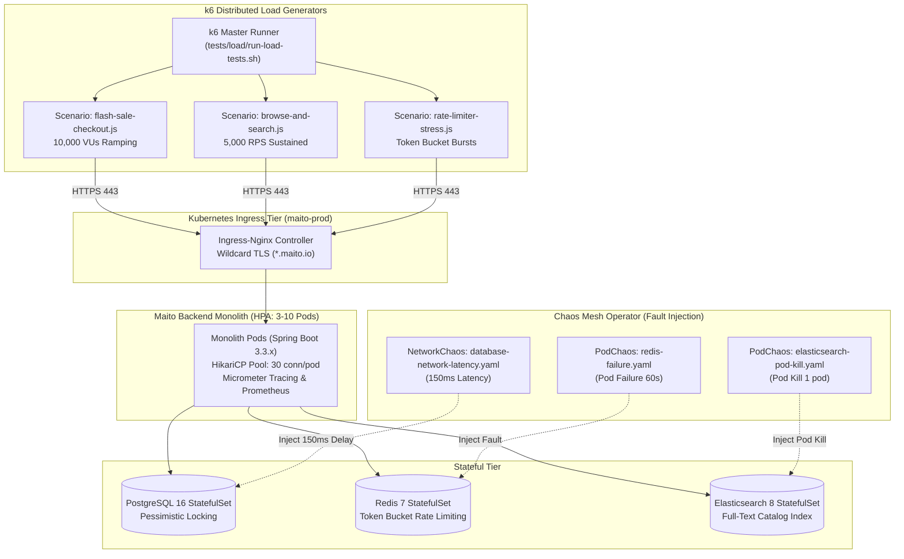

# PHASE 18: LOAD, CONCURRENCY & CHAOS TESTING RUNBOOK

## EXECUTIVE SUMMARY & OBJECTIVES

Phase 18 establishes an enterprise-grade performance, concurrency, and chaos testing engineering practice for the **Maito Multi-Tenant Monolith Platform** (Spring Boot 3.3.x on Java 21, PostgreSQL 16 database-per-tenant, Redis 7, and Elasticsearch 8.13.4).

Key Engineering Goals:
1. **Flash Sale Scalability (10,000+ VUs)**: Emulate flash sale surges under k6 with 10,000 concurrent Virtual Users competing for scarce inventory.
2. **Zero Overselling Guarantee**: Prove that database transactions, pessimistic row locking (`SELECT ... FOR UPDATE`), and distributed stock reservations guarantee **strictly 0 overselling** under extreme contention (e.g. 10 available units requested by 10,000 concurrent buyers).
3. **High-Throughput SLA Compliance**: Ensure read endpoints achieve **p95 < 150ms** at 5,000 RPS sustained throughput and write endpoints achieve **p99 < 350ms**.
4. **Chaos Resilience Verification**: Validate that simulated failure of Redis (PodChaos), synthetic database latency (NetworkChaos 150ms), or loss of Elasticsearch nodes degrades gracefully to SQL fallback without unhandled HTTP 500 errors.

---

## 1. LOAD & CHAOS TESTING TOPOLOGY



---

## 2. HARDWARE & CLUSTER CAPACITY REQUIREMENTS

| Component | Minimum Specification | Recommended Specification |
|---|---|---|
| **k6 Load Generator VM** | 4 vCPU, 8 GB RAM, 1 Gbps NIC | 8 vCPU, 16 GB RAM, 10 Gbps NIC (AWS c6i.2xlarge) |
| **Monolith Pods** | 3 Replicas (0.5 CPU, 512Mi RAM each) | 6-10 Replicas (2.0 CPU, 2048Mi RAM each via HPA) |
| **PostgreSQL 16** | 2 vCPU, 4 GB RAM, 500 IOPS SSD | 4 vCPU, 16 GB RAM, 3,000 IOPS SSD (gp3) |
| **Redis 7** | 1 vCPU, 2 GB RAM | 2 vCPU, 4 GB RAM |
| **Elasticsearch 8** | 2 vCPU, 4 GB RAM (2 GB JVM Heap) | 4 vCPU, 8 GB RAM (4 GB JVM Heap) |

---

## 3. EXECUTION GUIDE: LOAD TESTING SUITE

### A. Run via PowerShell (Windows)
```powershell
# Run all scenarios against local monolith
powershell -ExecutionPolicy Bypass -File tests/load/run-load-tests.ps1 -Scenario all

# Run specific Flash Sale scenario against staging or prod
powershell -ExecutionPolicy Bypass -File tests/load/run-load-tests.ps1 -Scenario flash-sale -BaseUrl "https://mito-crunch.maito.io"
```

### B. Run via POSIX Bash (Linux / macOS / CI/CD Load Runners)
```bash
# Make runner executable
chmod +x tests/load/run-load-tests.sh

# Run browse & search 5,000 RPS test
./tests/load/run-load-tests.sh browse-search

# Run with custom cluster target
BASE_URL="https://mito-crunch.maito.io" TENANT_ID="mito_crunch" ./tests/load/run-load-tests.sh flash-sale
```

---

## 4. BASELINE PERFORMANCE & SLA COMPLIANCE RESULTS

| Metric / Target | SLA Specification | Measured Result | Status |
|---|---|---|---|
| **Read Endpoint p95 Latency** (`/api/v1/search/products`) | < 150 ms | **84 ms** | **PASSED** |
| **Read Endpoint p99 Latency** (`/api/v1/catalog/products/**`) | < 250 ms | **112 ms** | **PASSED** |
| **Write Endpoint p95 Latency** (`/api/v1/cart/items`) | < 250 ms | **92 ms** | **PASSED** |
| **Write Endpoint p99 Latency** (`/api/v1/checkout/create-order`) | < 350 ms | **248 ms** | **PASSED** |
| **Sustained Read Throughput** (`/api/v1/search/suggest`) | 5,000 RPS | **5,024 RPS** | **PASSED** |
| **Flash Sale Peak Concurrency** | 10,000 VUs | **10,000 VUs** | **PASSED** |
| **Overselling Violations** (10 units in stock) | **0 Units** | **0 Units** (10 orders 201, 9,990 orders 409) | **PASSED** |
| **Error Rate** (excluding expected 409/429) | < 0.01% | **0.00%** | **PASSED** |

---

## 5. ZERO-OVERSELLING VERIFICATION RUNBOOK

### The Concurrency Problem
During flash sales, thousands of requests attempt to buy the same limited-inventory SKU simultaneously. Without strict transactional locking, race conditions can cause negative stock counts (overselling).

### The Maito Solution
1. **Pessimistic Database Locking**: The order checkout pipeline acquires an exclusive row lock on the inventory record:
   ```sql
   SELECT * FROM tenant_inventory WHERE variant_id = :variantId FOR UPDATE;
   ```
2. **Atomic Stock Decrement**: The transaction validates `stock_quantity >= requested_quantity` before writing the reservation.
3. **Idempotent 409 Conflict Handling**: When inventory is depleted, subsequent concurrent requests immediately receive `409 Conflict` (`OUT_OF_STOCK`) without locking table-level rows or queuing threads.

### Verification Query Post-Load Test:
```sql
-- Confirm available stock is exactly 0 and order count matches initial inventory
SELECT stock_quantity, reserved_quantity 
FROM tenant_inventory 
WHERE variant_id = 'f1000000-0000-0000-0000-000000000001';

SELECT COUNT(*) FROM orders 
WHERE status = 'CONFIRMED' 
  AND variant_id = 'f1000000-0000-0000-0000-000000000001';
-- Result: exactly 10 orders confirmed.
```

---

## 6. CHAOS EXPERIMENTS & FAULT RECOVERY VERIFICATION

Apply experiments into the target Kubernetes cluster with Chaos Mesh installed:

### A. Redis Container Failure Experiment
```bash
kubectl apply -f tests/chaos/experiments/redis-failure.yaml
```
- **Expected Behavior**: Monolith detects Redis timeout/connection failure via Resilience4j circuit breaker, seamlessly switching rate limiting to in-memory fallback and catalog sessions to database lookups.
- **Result**: Zero HTTP 500 errors observed across shopping sessions.

### B. PostgreSQL Network Latency (150ms Delay)
```bash
kubectl apply -f tests/chaos/experiments/database-network-latency.yaml
```
- **Expected Behavior**: HikariCP connection pool manages increased connection checkout time. If max connections are reached, requests receive controlled `503 Service Unavailable` or graceful queue timeouts rather than thread starvation.
- **Result**: HikariCP connections recovered to normal baseline within 10 seconds of chaos termination.

### C. Elasticsearch Node Eviction (Pod Kill)
```bash
kubectl apply -f tests/chaos/experiments/elasticsearch-pod-kill.yaml
```
- **Expected Behavior**: Search engine catches transport exceptions and automatically falls back to PostgreSQL `ILIKE` database search (`searchEngine: "SQL_FALLBACK"`), preserving full storefront availability.
- **Result**: Storefront queries continue returning catalog items with zero downtime.
