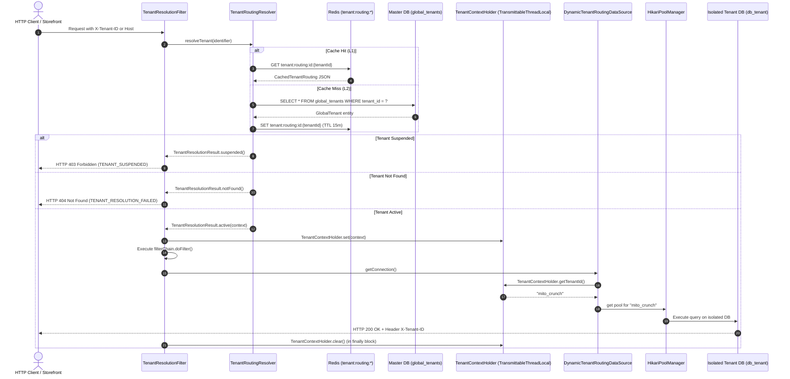

# Maito Multi-Tenant SaaS Platform: Phase-1 Architecture & Developer Runbook
**System**: `maito-backend-monolith`  
**Phase**: Phase 1 ("SaaS Multi-Tenancy Core Foundation")  
**STATUS: PERMANENTLY SEALED & LOCKED (Release Tag: v1.0.0-phase1-core)**  
**Branch**: `dev` (Sealed Baseline)  
**Target Audience**: Principal Architects, Lead Systems Engineers, Senior/Junior Backend Developers  

---

## 1. Executive Architectural Summary

### 1.1 Architecture Pattern
`maito-backend-monolith` employs a **Modular Monolith** pattern backed by **Physical Database-per-Tenant Isolation** and a centralized **Global Master Control Plane**.

* **Global Master Control Plane (`maito_db`)**: Stores tenant registrations (`global_tenants`), custom domains (`global_tenant_domains`), and global user identities (`global_users`). It contains zero consumer shopping or tenant business data.
* **Isolated Tenant Databases (`db_{tenant_slug}`)**: Every tenant provisioned receives a physically dedicated PostgreSQL database created at runtime. Tenant databases contain tenant-scoped users (`tenant_user_profiles`) and audit ledgers (`tenant_audit_log`), completely isolated from all other tenants.
* **20-Year Dynamic Schema Longevity**: To eliminate brittle database schema migrations when business configurations evolve, tenant routing configurations, regional profiles, entitlements, and RBAC matrices are modeled as PostgreSQL `JSONB` documents indexed via PostgreSQL **Generalized Inverted Indexes (GIN)**.

### 1.2 Dual DataSource & Dynamic Routing Pipeline
The platform avoids static connection configurations through a dynamic multi-pool routing engine:



### 1.3 Key Architectural Components
1. **`DynamicTenantRoutingDataSource`**: Extends Spring's `AbstractRoutingDataSource`. Overrides `determineCurrentLookupKey()` to query `TenantContextHolder.getTenantId()`. If no tenant context is bound, it seamlessly routes to `"master"`.
2. **`HikariPoolManager`**: Maintains an in-memory thread-safe `ConcurrentHashMap` of active `HikariDataSource` connection pools. Pools are lazily created or provisioned with strict multi-tenant boundaries (`minIdle: 2`, `maxPoolSize: 20`, `idleTimeout: 60s`, `connectionTimeout: 10s`).
3. **`TenantContextHolder`**: Backed by Alibaba `TransmittableThreadLocal`. Ensures tenant context propagates transparently into async executors and scheduled tasks without thread leakage.
4. **`TenantResolutionFilter`**: High-precedence servlet filter (`HIGHEST_PRECEDENCE + 10`). Inspects `X-Tenant-ID` header first, then inbound `Host` domain. Bypasses public endpoints (Swagger, Actuator, Health, Control Plane) and enforces security gates.

---

## 2. System Setup & Prerequisites

### 2.1 Software Prerequisites
| Component | Minimum Version | Default Port | Description |
|:---|:---|:---|:---|
| **Java JDK** | 21 LTS (Temurin / Eclipse Adoptium) | - | Virtual threads & modern language features |
| **PostgreSQL** | 16+ | `5432` | Master database and isolated tenant databases |
| **Redis** | 7.0+ | `6379` | L1 tenant routing cache |
| **Apache Maven** | 3.9+ | - | Maven wrapper (`mvnw.cmd` / `./mvnw`) included |

### 2.2 Local Environment Variables & Properties
Configured in `src/main/resources/application.yml` (overridable via shell environment):

```bash
# Database Configuration
SPRING_DATASOURCE_URL=jdbc:postgresql://localhost:5432/maito_db
SPRING_DATASOURCE_USERNAME=maito_user
SPRING_DATASOURCE_PASSWORD=maito_pass

# Redis Configuration
SPRING_REDIS_HOST=localhost
SPRING_REDIS_PORT=6379
SPRING_REDIS_PASSWORD=maito_redis_pass

# Platform Security Configuration
PLATFORM_ISOLATED_DB_USERS=false
```

### 2.3 Booting the Application
Execute from the project source directory:
* **Windows (PowerShell)**:
  ```powershell
  cmd.exe /c "set JAVA_HOME=C:\Program Files\Eclipse Adoptium\jdk-21.0.12.101-hotspot&& mvnw.cmd spring-boot:run"
  ```
* **Linux / macOS (Bash)**:
  ```bash
  export JAVA_HOME=/usr/lib/jvm/temurin-21
  ./mvnw spring-boot:run
  ```

---

## 3. Complete Phase-1 API Catalog

All platform responses adhere to the standard envelope `ApiResponse<T>`:
```json
{
  "success": true,
  "data": { ... },
  "error": null,
  "timestamp": "2026-10-05T01:50:00.000Z",
  "traceId": null
}
```

---

### Endpoint A: Provision New Isolated Tenant
Automates physical PostgreSQL database creation (`CREATE DATABASE db_{tenant_slug}`), applies tenant Liquibase migrations, registers a live dedicated HikariCP pool in memory, binds domains, and pre-warms Redis routing cache.

* **Method & URL**: `POST /api/v1/internal/platform/tenants`
* **Headers**: `Content-Type: application/json`, `Accept: application/json`
* **Request Body JSON**:
```json
{
  "tenantId": "mito_crunch",
  "tenantSlug": "mitocrunch",
  "legalName": "Mito Crunch Superfoods Pvt Ltd",
  "primaryDomain": "store.mitocrunch.com",
  "countryCode": "IN",
  "currencyCode": "INR",
  "initialAdminEmail": "admin@mitocrunch.com",
  "initialConfig": {
    "tier": "ENTERPRISE",
    "max_pool_size": 20
  }
}
```
* **Field Explanations**:
  * `tenantId` *(String, mandatory)*: Unique business ID.
  * `tenantSlug` *(String, mandatory)*: Unique URL-safe slug used for DB naming (`db_{tenantSlug}`).
  * `legalName` *(String, mandatory)*: Registered company name.
  * `primaryDomain` *(String, mandatory)*: Inbound custom domain mapping.
  * `countryCode` / `currencyCode` *(String)*: Localization seeds for `regional_profile` JSONB.
  * `initialConfig` *(Map, optional)*: Overrides for `routing_config` JSONB.

* **Success Response (HTTP 201 Created)**:
```json
{
  "success": true,
  "data": {
    "tenantId": "mito_crunch",
    "tenantSlug": "mitocrunch",
    "primaryDomain": "store.mitocrunch.com",
    "databaseName": "db_mitocrunch",
    "accountState": "ACTIVE",
    "provisionedAt": "2026-10-05T02:15:00.000Z",
    "message": "Tenant successfully provisioned with isolated database and live HikariCP pool."
  },
  "timestamp": "2026-10-05T02:15:00.000Z"
}
```

* **Error Responses**:
  * **HTTP 400 Bad Request (Validation Failure)**:
    ```json
    {
      "success": false,
      "error": {
        "code": "VALIDATION_FAILED",
        "message": "Request validation failed",
        "details": { "tenantId": "Tenant ID is mandatory" }
      },
      "timestamp": "2026-10-05T02:15:00.000Z"
    }
    ```
  * **HTTP 422 Unprocessable Entity (Duplicate Slug / ID / Domain)**:
    ```json
    {
      "success": false,
      "error": {
        "code": "MAITO_4002",
        "message": "Tenant ID already exists: mito_crunch"
      },
      "timestamp": "2026-10-05T02:15:00.000Z"
    }
    ```

* **cURL (PowerShell)**:
```powershell
curl.exe -X POST "http://localhost:8080/api/v1/internal/platform/tenants" `
  -H "Content-Type: application/json" `
  -d '{\"tenantId\":\"mito_crunch\",\"tenantSlug\":\"mitocrunch\",\"legalName\":\"Mito Crunch Pvt Ltd\",\"primaryDomain\":\"store.mitocrunch.com\",\"countryCode\":\"IN\",\"currencyCode\":\"INR\"}'
```
* **cURL (Bash)**:
```bash
curl -X POST "http://localhost:8080/api/v1/internal/platform/tenants" \
  -H "Content-Type: application/json" \
  -d '{
    "tenantId": "mito_crunch",
    "tenantSlug": "mitocrunch",
    "legalName": "Mito Crunch Pvt Ltd",
    "primaryDomain": "store.mitocrunch.com",
    "countryCode": "IN",
    "currencyCode": "INR"
  }'
```

---

### Endpoint B: Fetch Tenant Metadata
Retrieves tenant account state, routing configuration, regional settings, and tier entitlements from the Master Control Plane.

* **Method & URL**: `GET /api/v1/internal/platform/tenants/{tenantId}`
* **Headers**: `Accept: application/json`
* **Success Response (HTTP 200 OK)**:
```json
{
  "success": true,
  "data": {
    "tenantId": "mito_crunch",
    "tenantSlug": "mitocrunch",
    "legalEntityName": "Mito Crunch Superfoods Pvt Ltd",
    "accountState": "ACTIVE",
    "primaryDomain": "store.mitocrunch.com",
    "routingConfig": {
      "db_name": "db_mitocrunch",
      "max_pool_size": 20,
      "min_idle": 2,
      "idle_timeout_ms": 60000,
      "connection_timeout_ms": 10000
    },
    "regionalProfile": {
      "country": "IN",
      "currency": "INR",
      "locale": "en_IN",
      "timezone": "Asia/Kolkata"
    },
    "tierEntitlements": {
      "tier": "ENTERPRISE",
      "max_admin_users": 50,
      "features": ["ISOLATED_DB", "CUSTOM_DOMAIN", "AUDIT_LEDGER", "REALTIME_STOCK"]
    }
  },
  "timestamp": "2026-10-05T02:15:00.000Z"
}
```
* **Error Response (HTTP 404 Not Found)**:
```json
{
  "success": false,
  "error": {
    "code": "MAITO_4040",
    "message": "Tenant not found: unknown_tenant"
  },
  "timestamp": "2026-10-05T02:15:00.000Z"
}
```

* **cURL (PowerShell & Bash)**:
```bash
curl -X GET "http://localhost:8080/api/v1/internal/platform/tenants/mito_crunch"
```

---

### Endpoint C: Decommission Tenant & Evict Pool
Transitions tenant to `DECOMMISSIONED`, shuts down and evicts the live HikariCP connection pool, and invalidates all Redis cache keys (`tenant:routing:*`).

* **Method & URL**: `DELETE /api/v1/internal/platform/tenants/{tenantId}`
* **Success Response (HTTP 200 OK)**:
```json
{
  "success": true,
  "data": {
    "tenantId": "mito_crunch",
    "status": "DECOMMISSIONED",
    "message": "Tenant successfully decommissioned. Pool closed and routing cache evicted."
  },
  "timestamp": "2026-10-05T02:15:00.000Z"
}
```

* **cURL (PowerShell & Bash)**:
```bash
curl -X DELETE "http://localhost:8080/api/v1/internal/platform/tenants/mito_crunch"
```

---

### Endpoint D: Connection Pool Telemetry
Provides live connection pool metrics across all active tenant pools without exposing credentials or database URLs.

* **Method & URL**: `GET /api/v1/internal/platform/tenants/telemetry` *(also exposed via Actuator at `GET /actuator/tenants`)*
* **Success Response (HTTP 200 OK)**:
```json
{
  "success": true,
  "data": [
    {
      "tenantId": "mito_crunch",
      "activeConnections": 1,
      "idleConnections": 2,
      "totalConnections": 3,
      "threadsAwaitingConnection": 0,
      "status": "ACTIVE"
    }
  ],
  "timestamp": "2026-10-05T02:15:00.000Z"
}
```

* **cURL (PowerShell & Bash)**:
```bash
curl -X GET "http://localhost:8080/api/v1/internal/platform/tenants/telemetry"
```

---

### Endpoint E: Multi-Tenant Dynamic Routing & Security Gates
Tests `TenantResolutionFilter` on any non-bypassed endpoint (e.g. `/api/v1/orders`):

#### 1. Valid Header Resolution (`X-Tenant-ID`)
```bash
curl -i -X GET "http://localhost:8080/api/v1/orders" \
  -H "X-Tenant-ID: mito_crunch"
```
* **Result**: Response header contains `X-Tenant-ID: mito_crunch`. Database operations route to `db_mitocrunch`.

#### 2. Valid Domain Resolution (`Host`)
```bash
curl -i -X GET "http://localhost:8080/api/v1/orders" \
  -H "Host: store.mitocrunch.com"
```
* **Result**: Dynamically resolves domain `store.mitocrunch.com` to `mito_crunch`.

#### 3. Suspended Tenant Rejection (Security Gate)
```bash
curl -i -X GET "http://localhost:8080/api/v1/orders" \
  -H "X-Tenant-ID: suspended_tenant"
```
* **Expected Response (HTTP 403 Forbidden)**:
```json
{
  "success": false,
  "error": {
    "code": "TENANT_SUSPENDED",
    "message": "Tenant account is currently suspended. Please contact platform administration."
  },
  "timestamp": "2026-10-05T02:15:00.000Z"
}
```

#### 4. Unresolvable / Missing Tenant Rejection
```bash
curl -i -X GET "http://localhost:8080/api/v1/orders" \
  -H "X-Tenant-ID: non_existent_tenant"
```
* **Expected Response (HTTP 404 Not Found)**:
```json
{
  "success": false,
  "error": {
    "code": "TENANT_RESOLUTION_FAILED",
    "message": "Invalid or unresolvable tenant. Verify X-Tenant-ID header or Host mapping."
  },
  "timestamp": "2026-10-05T02:15:00.000Z"
}
```

---

## 4. Local Multi-Tenant Verification Protocol (Step-by-Step)

Follow this testing procedure on a fresh development instance:

### Step 1: Start PostgreSQL, Redis, and Monolith Application
Ensure PostgreSQL is running locally on port 5432 and Redis on port 6379. Start the Spring Boot application.

### Step 2: Provision Tenant A (`MITO_CRUNCH`)
```bash
curl -X POST "http://localhost:8080/api/v1/internal/platform/tenants" \
  -H "Content-Type: application/json" \
  -d '{
    "tenantId": "MITO_CRUNCH",
    "tenantSlug": "mito_crunch",
    "legalName": "Mito Crunch Superfoods Pvt Ltd",
    "primaryDomain": "store.mitocrunch.com",
    "countryCode": "IN",
    "currencyCode": "INR"
  }'
```
*Verify response status is `201 Created`.*

### Step 3: Provision Tenant B (`VIJIYA_SOLAR`)
```bash
curl -X POST "http://localhost:8080/api/v1/internal/platform/tenants" \
  -H "Content-Type: application/json" \
  -d '{
    "tenantId": "VIJIYA_SOLAR",
    "tenantSlug": "vijiya_solar",
    "legalName": "Vijiya Solar Energy Solutions Ltd",
    "primaryDomain": "solar.vijiyagroup.com",
    "countryCode": "IN",
    "currencyCode": "INR"
  }'
```
*Verify response status is `201 Created`.*

### Step 4: Verify Physical Databases in PostgreSQL (`psql`)
Open a terminal and connect to PostgreSQL:
```bash
psql -U maito_user -d maito_db
```
Execute `\l` to list databases:
```text
maito_db=> \l
                                  List of databases
       Name       |   Owner    | Encoding | Collate | Ctype |   Access privileges   
------------------+------------+----------+---------+-------+-----------------------
 db_mito_crunch   | maito_user | UTF8     | ...     | ...   | 
 db_vijiya_solar  | maito_user | UTF8     | ...     | ...   | 
 maito_db         | maito_user | UTF8     | ...     | ...   | 
```
Inspect schema inside `db_mito_crunch`:
```bash
\c db_mito_crunch
\dt
```
*Output confirms `tenant_user_profiles`, `tenant_audit_log`, `databasechangelog`, and `databasechangeloglock`.*

### Step 5: Verify Live HikariCP Pools in Telemetry
```bash
curl -X GET "http://localhost:8080/api/v1/internal/platform/tenants/telemetry"
```
*Output will list two active pools (`mito_crunch` and `vijiya_solar`) with total connections ready.*

### Step 6: Verify Safe Decommissioning
```bash
curl -X DELETE "http://localhost:8080/api/v1/internal/platform/tenants/mito_crunch"
```
*Re-query telemetry: `mito_crunch` pool is removed and evicted from memory.*

---

## 5. Known Invariants & Future Transition Rules (Phase 2 Headless CMS)

When developing Phase 2 features (Headless CMS, Product Catalogs, Price Books), adhere strictly to these engineering invariants:

1. **Master Control Plane Invariant**:
   * The Master DB (`maito_db`) must **NEVER** hold business domain models (no products, no prices, no orders, no cart tables).
   * Any change to master control plane tables must be placed exclusively under `src/main/resources/db/changelog/master/`.
2. **Tenant Base Schema Invariant**:
   * All future tenant domain tables (e.g. `cms_pages`, `cms_blocks`, `catalog_items`, `price_tiers`) must be declared under `src/main/resources/db/changelog/tenant/` and included in `tenant-changelog.xml`.
   * Newly provisioned tenants automatically execute these changelogs during the provisioning lifecycle.
3. **No Cross-Tenant Foreign Keys**:
   * Tenant tables reside on physically distinct databases. Never attempt cross-database foreign keys. Cross-tenant references must use canonical UUID strings with asynchronous event sync (Kafka).
4. **JSONB Extensibility Principle**:
   * New custom fields, attribute sets, and category hierarchies must be stored in PostgreSQL `JSONB` columns with GIN indexes (`CREATE INDEX ... USING gin (...)`), preserving schema longevity without requiring disruptive DDL migrations across thousands of tenant databases.